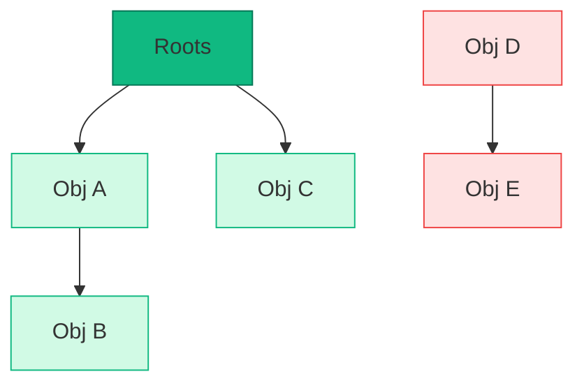

# 🔥 MEMORY MANAGEMENT & GC (ARCHITECTURE LEVEL)

## Stack · Heap · Mark-and-Sweep · Generational GC · Memory Leaks

JavaScript manages memory **automatically**, but understanding **how** prevents leaks and performance kills..

---

## 1️⃣ MEMORY LIFECYCLE

Regardless of language, memory follows:

1.  **Allocate** (V8 does this)
2.  **Use** (Read/Write)
3.  **Release** (Garbage Collection)

In C++, you do #1 and #3 manually.
In JS, V8 handles #1 and #3.

---

## 2️⃣ STACK vs HEAP (RECAP)

| Feature | Stack (Static) | Heap (Dynamic) |
| :--- | :--- | :--- |
| **Data** | Primitives, References | Objects, Functions, Arrays |
| **Size** | Small, Fixed | Large, Flexible |
| **Speed** | Ultra Fast (LIFO) | Slower (Pointer lookup) |
| **Cleanup** | Auto (Pop frame) | **Garbage Collector** |

```mermaid
graph LR
    subgraph S[Stack]
        direction BT
        V1[val: 10]
        REF[obj_ptr]
    end
    
    subgraph H[Heap]
        OBJ[Object { name: 'A' }]
    end
    
    REF -.->|Points to| OBJ
    
    style S fill:#f0f9ff,stroke:#3b82f6
    style H fill:#f3e8ff,stroke:#8b5cf6
```


---

## 3️⃣ REACHABILITY (THE GOLDEN RULE)

V8's GC creates a "Root" set:
*   Global window/process
*   Current Call Stack
*   Active Closures

**Algorithm:**
"If I can travel from Root → Object, it is **Reachable (Alive)**. If not, it is **Garbage (Dead)**."

---

## 4️⃣ GC ALGORITHM 1: MARK-AND-SWEEP

This is the classic "Full GC".

### Step 1: Marking (Stop-the-World)
V8 pauses JS execution. It traverses **all** pointers from roots and "marks" visited objects as live.

### Step 2: Sweeping
V8 scans memory. Anything **NOT marked** is deleted.

### Step 3: Compacting
V8 moves live objects together to prevent **fragmentation**.




> **D and E** are connected to each other, but **disconnected from Root**. They are garbage (Islands).

---

## 5️⃣ GC ALGORITHM 2: GENERATIONAL GC (ORINOCO)

V8 splits heap into two:
1.  **New Space** (Young Generation)
2.  **Old Space** (Old Generation)

### The Hypothesis
> "Most objects die young." (e.g., temporary variables, loop iterators)

### Scavenger (Minor GC)
*   Runs frequently (every 1-5ms).
*   Only checks **New Space**.
*   Survivors are copied to **Old Space**. (Promotion).

### Major GC (Full Mark-Sweep-Compact)
*   Runs rarely.
*   Checks **Old Space**.
*   More expensive (can freeze UI).

---

## 6️⃣ V8 OPTIMIZATIONS (PERFORMANCE)

### Incremental Marking
Instead of pausing for 100ms, V8 pauses for 5ms, marks a bit, runs JS, marks a bit...
Keeps UI responsive.

### Idle-time GC
GC runs when Chrome detects the browser is idle.

### Concurrent Marking
Helper threads mark objects **while JS is running** on main thread.

---

## 7️⃣ COMMON MEMORY LEAKS

### 1. Unexpected Globals
```js
function foo() {
  bar = "leaked"; // window.bar
}
```

### 2. Forgotten Timers
```js
setInterval(() => {
  // references a huge object
}, 1000);
```
If you don't `clearInterval`, the object never dies.

### 3. Detached DOM Nodes
```js
let button = document.getElementById('btn');
document.body.removeChild(button);
// button is REMOVED from DOM
// BUT 'button' variable still references it!
// Memory NOT freed.
```

---

## ✅ YOU NOW UNDERSTAND
* Why JS pauses sometimes (GC)
* Why keeping references alive prevents cleanup
* How V8 optimizes for short-lived objects
* How "Islands of objects" are cleaned up

This chapter is **complete**.
