## 🎯 What You'll Learn

By the end of this guide, you'll understand:
- The journey of JavaScript code from source to execution
- How the **V8 Engine** parses and compiles your code
- The role of the **AST (Abstract Syntax Tree)**
- The difference between **Ignition** (Interpreter) and **TurboFan** (Compiler)
- Why JavaScript is called a **JIT (Just-In-Time) Compiled** language

---

## 🛠️ The Execution Pipeline

```mermaid
flowchart LR
    subgraph V8 [🧠 V8 Engine Pipeline]
        direction LR
        Source[📄 Source Code] -- Tokenizer --> Tokens[🧱 Tokens]
        Tokens -- Parser --> AST[🌳 AST]
        AST -- Ignition --> Bytecode[⚙️ Bytecode]
        Bytecode -- TurboFan JIT --> MachineCode[⚡ Machine Code]
        MachineCode -. De-opt .-> Bytecode
        
        style Source fill:#fff1f2,stroke:#e11d48,stroke-width:2px
        style Tokens fill:#fff7ed,stroke:#ea580c,stroke-width:2px
        style AST fill:#fefce8,stroke:#ca8a04,stroke-width:2px
        style Bytecode fill:#eff6ff,stroke:#2563eb,stroke-width:2px
        style MachineCode fill:#f3e8ff,stroke:#9333ea,stroke-width:2px
    end
```





---

## 1️⃣ Tokenizer (The Scanner)
**Goal:** Break sentences into words.

It reads your raw code and chops it into "tokens" (meaningful chunks).

**Example Code:**
```javascript
let a = 10;
```

**Becomes Tokens:**
```json
["let", "a", "=", "10", ";"]
```
*It doesn't understand the code yet; it just separates the pieces.*

---

## 2️⃣ Parser (The Architect)
**Goal:** Understand the grammar and build a tree.

The parser takes those tokens and builds an **Abstract Syntax Tree (AST)**. This is how the computer understands the *structure* of your code.

**The AST looks like this:**
```json
{
  "Type": "VariableDeclaration",
  "Identifier": "a",
  "Value": "10"
}
```

> **Note:** Tools like **Babel** (for React) and **Webpack** work by changing this AST.

---

## 3️⃣ Interpreter (The Runner)
**Goal:** Run the code fast (but not optimized).

In V8, this is called **Ignition**.
- It walks through the AST.
- It converts it to **Bytecode** (simple instructions for the engine).
- It executes it immediately.

---

## 4️⃣ JIT Compiler (The Optimizer)
**Goal:** Make the code super fast.

In V8, this is called **TurboFan**.
- It watches the code running.
- If a function runs many times (it's "hot"), the JIT compiler kicks in.
- It rewrites that part into **Optimized Machine Code** (0s and 1s) for your specific CPU.

**Result:** Your app runs at near-native speed! ⚡

---

## 🎓 Practice Questions

::: details **Question 1: What connects the Parser to the Machine Code?**
<details>
<summary>Answer</summary>

**The Interpreter (Ignition) and Compiler (TurboFan)**.
The Parser builds the AST, which Ignition converts to Bytecode. Then, TurboFan optimizes that Bytecode into Machine Code.
</details>
:::

::: details **Question 2: Why does JavaScript need a JIT Compiler?**
<details>
<summary>Answer</summary>

JavaScript is a dynamic language. JIT (Just-In-Time) compilation allows it to **start fast** (using the interpreter) and **run fast** (using the compiler for hot code), getting the best of both worlds.
</details>
:::
