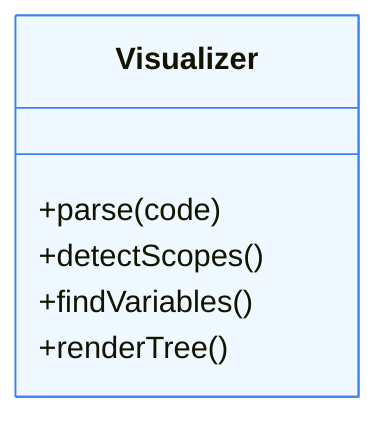

# 🛠 PROJECT — BUILD A CLOSURE VISUALIZER

## Analyze Scopes · Detect Retention · Visualize Memory

This project will help you **see** invisible closures.

---

## 🎯 GOAL

Build a tool that takes a JS function text, analyzes it, and produces a visualization of **nested scopes** and **captured variables**.

**Input:**
```js
function outer() {
  let a = 1;
  return () => a + 1;
}
```

**Output:**
```
[Global]
  └── [Outer Scope] { a: 1 }
       └── [Closure] Captures: { a }
```

---

## 🧩 ARCHITECTURE

We will use a simple **Regex-based parser** (for education) to detect function nesting.




---

## 1️⃣ STEP 1: DETECTING SCOPES

We look for `{` and `}` to track depth.

```js
let depth = 0;
const scopes = [];

// Pseudo-code loop char by char
if (char === '{') {
  depth++;
  scopes.push({ id: depth, parent: depth-1 });
}
```

---

## 2️⃣ STEP 2: VARIABLE DECLARATION

Find `let`, `const`, `var`.

```js
const varRegex = /(?:let|const|var)\s+(\w+)/g;
```

Map variables to their current **Scope ID**.

---

## 3️⃣ STEP 3: USAGE DETECTION (CLOSURE CHECK)

If a variable is **used** in Scope B, but **defined** in Scope A (and A is usually parent of B):
-> **It is a Closure Variable**.

```js
if (usageScope > defScope) {
  markAsCaptured(variable);
}
```

---

## 4️⃣ STEP 4: VISUALIZATION

We can print a tree or generate Mermaid/HTML.

```js
function render(scope) {
  console.log("  ".repeat(scope.depth) + `Scope ${scope.id}`);
  console.log("  ".repeat(scope.depth) + `Vars: ${scope.vars}`);
  if (scope.captures.length) {
    console.log("  ".repeat(scope.depth) + `⚠️ CLOSURE: ${scope.captures}`);
  }
}
```

---

## 5️⃣ EXAMPLE IMPLEMENTATION CONCEPTS

This project teaches you:
1.  **Static Analysis**: Reading code without running it.
2.  **Scope Tree**: How parsers view nesting.
3.  **Reference Counting**: Determining if a value "escapes".

---

## ✅ SUMMARY

In a real tool (like Chrome DevTools), this logic happens inside V8's **Scope Analysis** phase.
Building this simple version proves you understand **Rules of Scoping**.

This usage of **Architecture knowledge** to build **DevTools** is a senior-level skill.

This project guide is **complete**.
