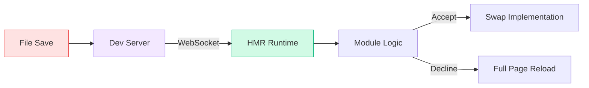

# 🔥 TOOLCHAIN ARCHITECTURE (WEBPACK / VITE)

## Bundlers · Native ESM · HMR · Dependency Graphs

Toolchains are not magic. They are **AST pipelines**.

---

## 1️⃣ THE TWO ERAS OF TOOLING

### Era 1: Bundlers (Webpack, Rollup, Parcel)
**Philosophy**: "Browsers can't run my code. I must combine everything into one file."
**Mechanism**:
1. Scan entry point.
2. Traverse imports (Recursively).
3. Build **Dependency Graph**.
4. Bundle into one `bundle.js`.

### Era 2: Native ESM (Vite, Snowpack)
**Philosophy**: "Modern browsers speak ESM. Let them handle imports."
**Mechanism**:
1. Start Server.
2. Browser requests `index.js`.
3. Server intercepts `import`, compiles **just that file**, and sends it.
4. No bundling in Dev.

---

## 2️⃣ WEBPACK ARCHITECTURE (BUNDLE-BASED)

Webpack is an **Event-Driven Plugin System** built on **Tapable**.

### The Pipeline

```mermaid
graph TD
    INIT[1. Init (Read Config)] --> RUN[2. Run]
    RUN --> MAKE[3. Make (Module Graph)]
    MAKE --> SEAL[4. Seal (Chunk Layout)]
    SEAL --> EMIT[5. Emit (Write Assets)]
    
    subgraph MAKE_PHASE [Make Phase]
    RESOLVE[Resolve Path] --> PARSE[Parse (AST)]
    PARSE --> TRANSFORM[Loaders (TS->JS)]
    end
    
    MAKE -.-> MAKE_PHASE
    
    style INIT fill:#f3f4f6,stroke:#94a3b8
    style RUN fill:#dbeafe,stroke:#3b82f6
    style MAKE fill:#f3e8ff,stroke:#8b5cf6
    style SEAL fill:#f0f9ff,stroke:#64748b
    style EMIT fill:#d1fae5,stroke:#10b981
```

**Key Concept**: "Loaders" transform files. "Plugins" listen to events.

---

## 3️⃣ VITE ARCHITECTURE (UNBUNDLED)

Vite uses **esbuild** (Go) for dependency pre-bundling and **Native ESM** for source code.

### Dev Server Flow
1. Browser: `GET /src/App.jsx`
2. Vite: Intercepts request.
3. Vite: Transforms JSX -> JS (using esbuild/SWC).
4. Vite: Sends to browser.
5. Browser: Sees `import "./Header"`, sends new request.

**Result**: Startup is O(1). Constant time.

---

## 4️⃣ HOT MODULE REPLACEMENT (HMR) INTERNALS

How does code update without refreshing?

### The Architecture
1. **Server**: Detects file change (`App.jsx`).
2. **Server**: Pushes update to Browser via **WebSocket**.
3. **Browser Runtime** (`client.js`): Receives payload.
4. **Runtime**: bubbles/propagates signal.
5. **Component**: `module.hot.accept()` catches the signal and re-renders.



---

## ✅ YOU NOW UNDERSTAND
* Why Vite is faster than Webpack (Dev vs Bundling)
* That HMR is just WebSockets + Client Runtime

**Next Chapter:** We dive deep into **AST & Babel**.
