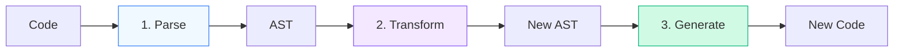

# 🔥 BABEL & AST INTERNALS (COMPILER DEEP DIVE)

## AST · Visitor Pattern · Plugins · Transpilation

You cannot be a Senior Engineer without understanding the **Abstract Syntax Tree (AST)**.
It is how **Babel**, **ESLint**, **Prettier**, and **Webpack** assume to understand your code.

---

## 1️⃣ WHAT IS AN AST?

Code is just text. The Engine needs a **Tree**.

**Code:**
```js
const a = 1;
```

**AST (Simplified):**
```json
{
  "type": "VariableDeclaration",
  "kind": "const",
  "declarations": [
    {
      "type": "VariableDeclarator",
      "id": { "type": "Identifier", "name": "a" },
      "init": { "type": "NumericLiteral", "value": 1 }
    }
  ]
}
```

---

## 2️⃣ THE BABEL PIPELINE (3 STAGES)

Babel is a **Transpiler**. It takes Source execution -> AST -> New Source.

### Phase 1: PARSE (Reading)
**Input**: Code string
**Output**: AST
**Tools**: `@babel/parser` (Babylon)

### Phase 2: TRANSFORM (Magic happens here) 🪄
**Input**: AST
**Output**: Modified AST
**Tools**: `@babel/traverse` (Plugins)

### Phase 3: GENERATE (Writing)
**Input**: Modified AST
**Output**: new Code String + Sourcemaps
**Tools**: `@babel/generator`



---

## 3️⃣ STAGE 2: THE VISITOR PATTERN (PLUGIN DEV)

How do plugins actually change code? They **Visit** nodes.

Imagine walking through the tree. Every time you see a specific node type, you stop and run a function.

### Example: Arrow Function Plugin
We want to convert `const f = () => {}` to `var f = function() {}`.

**The Visitor:**

```js
const visitor = {
  ArrowFunctionExpression(path) {
    // 1. Create new Function Expression
    const body = path.node.body;
    const params = path.node.params;
    
    // 2. Replace current node
    path.replaceWith(
      types.functionExpression(null, params, body)
    );
  }
};
```

Babel runs this `transform()` function on every matching node.

---

## 4️⃣ COMPUTED PROPERTIES & TRAVERSAL

Traversal is **Depth-First**.

```
Program
 └── VariableDeclaration
      └── VariableDeclarator
           ├── Identifier (name: a)
           └── NumericLiteral (value: 1)
```

Babel goes down to `Identifier`, checks visitors, then `NumericLiteral`, then back up.

---

## 5️⃣ WHY THIS MATTERS

If you want to write:
*   **Custom ESLint Rules**: You analyze AST.
*   **Codemods** (Migrate 1000 files): You mutate AST.
*   **Custom Babel Plugins**: You use Visitor pattern.

### Tool Highlight: AST Explorer
Using `astexplorer.net` is the standard way to debug ASTs.

---

## ✅ YOU NOW UNDERSTAND
* Why Babel needs 3 steps (Parse, Transform, Generate)
* How Plugins work (Visitor Pattern)
* How to programmatically edit code

This chapter is **complete**.
