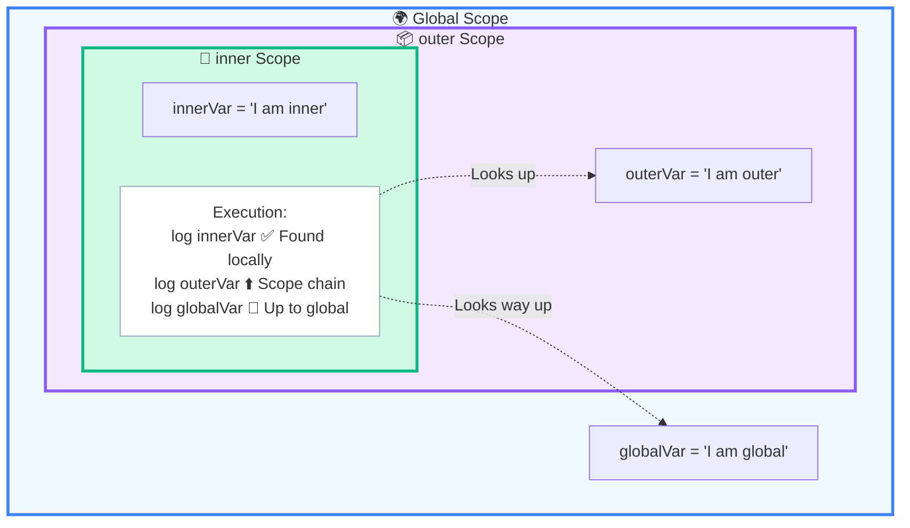
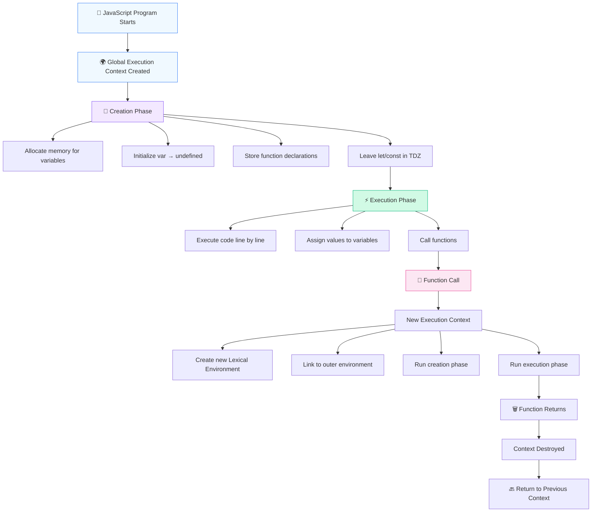

# 🎯 JavaScript Execution Context Deep Dive

## What You'll Learn

By the end of this guide, you'll understand:
- How JavaScript creates execution contexts
- What lexical environments are and why they matter
- How the scope chain resolves variables
- The real truth about hoisting (it's not what you think!)
- Why Temporal Dead Zone (TDZ) exists
- How all of this connects to React and modern JavaScript

---

## 1️⃣ EXECUTION CONTEXT (EC)

### 📦 "The container in which JavaScript code runs"

When JavaScript runs **any code**, it does **NOT** execute it directly.

Instead, the JS engine **creates an Execution Context** and pushes it onto the **Call Stack**.

Think of an Execution Context as a **runtime frame** that contains everything needed to execute code:
- Variables
- Functions
- Scope information
- The `this` keyword

---

### Types of Execution Contexts

::: info 🧩 Three Types of Execution Contexts

1. **Global Execution Context (GEC)**
   - Created once when the program starts
   - Only one GEC exists per JavaScript runtime
   - Creates the global object (`window` in browsers, `global` in Node.js)

2. **Function Execution Context (FEC)**
   - Created every time a function is invoked
   - Each function call gets its own fresh context
   - Destroyed when function execution completes

3. **Eval Execution Context**
   - Created when code runs inside `eval()`
   - Rare and deprecated (avoid using `eval()`)

:::

---

### What Does an Execution Context Contain?

```
Execution Context
├── Variable Environment
│   └── Stores var declarations and function declarations
├── Lexical Environment
│   └── Stores let/const and provides scope chain
└── This Binding
    └── Determines the value of 'this'
```

::: tip 💡 Key Insight
The Execution Context is like a **box** that holds all the information JavaScript needs to run your code. Each function call creates a new box, and these boxes stack on top of each other in the **Call Stack**.
:::

---

### 🖼️ Visualizing the Execution Context

::: info 🧠 Execution Context Structure

```mermaid
graph TB
    EC[📦 Execution Context Object]
    VE[Variable Environment<br/>Purple Zone]
    LE[Lexical Environment<br/>Green Zone]
    
    EC --> VE
    EC --> LE
    
    VE --> V1[var city = undefined]
    VE --> V2[function greet = &#123;...&#125;]
    
    LE --> L1[const id = &lt;uninitialized&gt;]
    LE --> L2[let name = 'Raj']
    LE --> L3[Outer Reference 🔗]
    
    L3 -.->|Points to| PARENT[Parent Scope]
    
    style EC fill:#f0f9ff,stroke:#3b82f6,stroke-width:3px
    style VE fill:#f3e8ff,stroke:#8b5cf6,stroke-width:2px
    style LE fill:#d1fae5,stroke:#10b981,stroke-width:2px
    style V1 fill:#fff,stroke:#7c3aed
    style V2 fill:#fff,stroke:#7c3aed
    style L1 fill:#fff,stroke:#dc2626
    style L2 fill:#fff,stroke:#059669
    style L3 fill:#dbeafe,stroke:#1d4ed8
```



:::

---

## 2️⃣ TWO PHASES OF EXECUTION CONTEXT

Every execution context is created in **two distinct phases**. Understanding these phases is crucial to understanding hoisting, TDZ, and variable behavior.

---

### 🔹 Phase 1: Creation Phase (Memory Allocation / Hoisting Phase)

During this phase, **before any code executes**:

1. **Memory is allocated** for variables and functions
2. **Variables are initialized** (but not assigned values yet)
3. **Functions are fully stored** in memory
4. **Scope links are created** (outer environment references)

#### Rules for Different Declaration Types:

| Declaration Type | Creation Phase Behavior |
|-----------------|------------------------|
| `var` | Initialized as `undefined` |
| `let` / `const` | Allocated but **not initialized** (TDZ) |
| `function` declarations | Fully stored with complete definition |
| `this` | Resolved and bound |

---

### 🔹 Phase 2: Execution Phase

During this phase:

1. **Code runs line by line** (top to bottom)
2. **Values are assigned** to variables
3. **Functions are executed** when called
4. **Expressions are evaluated**

---

### 📊 The Two Phases: A Visual Flow

::: info 🔄 The Lifecycle of Execution

```mermaid
graph LR
    subgraph SOURCE[📜 Source Code]
        S1[console.log a]
        S2[var a = 10]
        S3[console.log a]
        S4[let b = 20]
        S5[function hi]
    end
    
    subgraph CREATION[1️⃣ Creation Phase]
        C1[a: undefined]
        C2[b: &lt;TDZ&gt; 🚫]
        C3[hi: function code ✅]
    end
    
    subgraph EXECUTION[2️⃣ Execution Phase]
        E1[1. log a → undefined]
        E2[2. a = 10 ✅]
        E3[3. log a → 10]
        E4[4. b = 20 TDZ ends]
        E5[Final Memory:<br/>a: 10, b: 20]
    end
    
    SOURCE --> CREATION
    CREATION --> EXECUTION
    
    style SOURCE fill:#1e293b,color:#e2e8f0
    style CREATION fill:#f3e8ff,stroke:#8b5cf6,stroke-width:2px
    style EXECUTION fill:#d1fae5,stroke:#10b981,stroke-width:2px
    style C2 fill:#fee2e2,stroke:#ef4444,stroke-dasharray:5
    style E5 fill:#fff7ed,stroke:#f97316
```



:::

---

### 📊 Visual Example: Two Phases in Action

```javascript
console.log(a); // What happens here?
var a = 10;
console.log(a); // What about here?
```

::: details 🔍 Click to see the breakdown

**Creation Phase:**
```
Memory:
a → undefined
```

**Execution Phase:**
```
Line 1: console.log(a)  → Outputs: undefined
Line 2: a = 10          → Assigns 10 to a
Line 3: console.log(a)  → Outputs: 10
```

This is why `var` declarations are "hoisted" - they're available (as `undefined`) before the line where they're declared!

:::

---

## 3️⃣ LEXICAL ENVIRONMENT (LE)

### 🌳 "Where variables actually live"

A **Lexical Environment** is an internal data structure created by the JavaScript engine. It's the actual place where variable bindings (name-value pairs) are stored.

---

### Structure of a Lexical Environment

```
Lexical Environment
├── Environment Record
│   └── Stores actual variable/function bindings
│   └── (The "storage" of variables)
└── Outer Reference
    └── Points to parent lexical environment
    └── (Creates the scope chain)
```

::: tip 💡 Key Insight
The **Outer Reference** is what makes scope work! It's a pointer to the parent scope, creating a chain that JavaScript uses to look up variables.
:::

---

### 📝 Example: Nested Lexical Environments

```javascript
let globalVar = 'I am global';

function outer() {
  let outerVar = 'I am outer';
  
  function inner() {
    let innerVar = 'I am inner';
    console.log(innerVar);  // ✅ Found in inner LE
    console.log(outerVar);  // ✅ Found in outer LE (via outer reference)
    console.log(globalVar); // ✅ Found in global LE (via chain)
  }
  
  inner();
}

outer();
```

---

### 🗺️ Lexical Environment Structure for Above Code

::: info 🧠 Lexical Environment Chain

```
Global Lexical Environment
├── Environment Record:
│   └── globalVar: 'I am global'
│   └── outer: <function>
└── Outer Reference: null (no parent)

outer() Lexical Environment
├── Environment Record:
│   └── outerVar: 'I am outer'
│   └── inner: <function>
└── Outer Reference: → Global LE

inner() Lexical Environment
├── Environment Record:
│   └── innerVar: 'I am inner'
└── Outer Reference: → outer() LE
```

:::

---

### 🕸️ Visualizing the Scope Chain

::: info 🔗 How Scopes are Nested



:::

---

## 4️⃣ SCOPE CHAIN

### 🔗 "How JavaScript finds variables"

When JavaScript encounters a variable, it doesn't magically know where it is. It follows a **systematic lookup process** called the **Scope Chain**.

---

### The Lookup Process

When you reference a variable like `console.log(myVar)`, JavaScript searches in this order:

```
1. Current Lexical Environment
   ↓ (not found)
2. Outer Lexical Environment (parent)
   ↓ (not found)
3. Outer's Outer (grandparent)
   ↓ (not found)
4. ... continues up the chain ...
   ↓ (not found)
5. Global Lexical Environment
   ↓ (not found)
6. ❌ ReferenceError: myVar is not defined
```

---

### 🎯 CRITICAL RULE: Lexical (Static) Scoping

::: warning ⚠️ VERY IMPORTANT
JavaScript uses **LEXICAL (STATIC) SCOPING**

This means:
- Scope is determined **where the function is written** (at author time)
- **NOT** where the function is called (at runtime)
- **NOT** based on call order or execution flow

The word "lexical" means "relating to the text" - it's about the physical structure of your code!
:::

---

### 📝 Example: Lexical Scoping in Action

```javascript
let x = 10;

function outer() {
  let x = 20;
  
  function inner() {
    console.log(x); // Which x? 10 or 20?
  }
  
  return inner;
}

let myFunc = outer();
myFunc(); // Output: 20
```

::: details 🔍 Why does it output 20?

Because `inner()` is **written inside** `outer()`, it has access to `outer()`'s lexical environment.

Even though `myFunc()` is called in the global scope, `inner()` remembers where it was **defined**, not where it's **called**.

This is the foundation of **closures**!

:::

---

## 5️⃣ HOISTING (The Real Definition)

### 🎈 "NOT variables moving to the top!"

Most tutorials say "hoisting moves declarations to the top." This is **misleading**.

---

### ✅ The Correct Definition

::: tip 💡 What Hoisting Really Is
**Hoisting** is the behavior of the **Creation Phase** of the Execution Context.

During the creation phase:
- Memory is allocated for declarations
- Variables are initialized (or not, depending on type)
- This happens **before** code execution

It's not about "moving" code - it's about **two-phase execution**.
:::

---

### 📝 Example 1: `var` Hoisting

```javascript
console.log(a); // undefined (not an error!)
var a = 10;
console.log(a); // 10
```

**What actually happens:**

::: details 🔍 Step-by-step breakdown

**Creation Phase:**
```javascript
// Memory allocated:
a → undefined
```

**Execution Phase:**
```javascript
console.log(a);  // Reads from memory: undefined
a = 10;          // Assigns value
console.log(a);  // Reads from memory: 10
```

:::

---

### 📝 Example 2: Function Declaration Hoisting

```javascript
sayHi(); // "Hi!" (works perfectly!)

function sayHi() {
  console.log("Hi!");
}
```

**What actually happens:**

::: details 🔍 Step-by-step breakdown

**Creation Phase:**
```javascript
// Entire function stored in memory:
sayHi → function() { console.log("Hi!"); }
```

**Execution Phase:**
```javascript
sayHi(); // Function already exists, executes normally
```

Function declarations are **fully hoisted** - both name and body!

:::

---

### 📝 Example 3: Function Expression (Different Behavior!)

```javascript
sayHi(); // ❌ TypeError: sayHi is not a function

var sayHi = function() {
  console.log("Hi!");
};
```

**What actually happens:**

::: details 🔍 Step-by-step breakdown

**Creation Phase:**
```javascript
// Only variable name is hoisted:
sayHi → undefined
```

**Execution Phase:**
```javascript
sayHi();  // Tries to call undefined() → TypeError!
sayHi = function() { ... }; // Assignment happens here
```

Function expressions are treated like variable assignments!

:::

---

### 📊 Hoisting Comparison Table

| Declaration Type | Hoisted? | Initialized? | Can Use Before Declaration? |
|-----------------|----------|--------------|----------------------------|
| `var` | ✅ Yes | ✅ Yes (`undefined`) | ✅ Yes (value is `undefined`) |
| `let` | ✅ Yes | ❌ No (TDZ) | ❌ No (ReferenceError) |
| `const` | ✅ Yes | ❌ No (TDZ) | ❌ No (ReferenceError) |
| `function` declaration | ✅ Yes | ✅ Yes (full function) | ✅ Yes (fully usable) |
| `function` expression | ✅ Yes (as `var`) | ✅ Yes (`undefined`) | ❌ No (TypeError) |
| `class` | ✅ Yes | ❌ No (TDZ) | ❌ No (ReferenceError) |

---

## 6️⃣ TEMPORAL DEAD ZONE (TDZ)

### ⏱️ "The time between scope creation and variable initialization"

This is where most developers get confused about `let` and `const`.

---

### What is the TDZ?

::: danger 🚫 Temporal Dead Zone
The **Temporal Dead Zone** is the period between:
1. When a scope is created (and the variable is allocated in memory)
2. When the variable is initialized (when the code reaches the declaration)

During this time, the variable **exists** but **cannot be accessed**.
:::

---

### 📝 Example: TDZ in Action

```javascript
console.log(a); // ❌ ReferenceError: Cannot access 'a' before initialization
let a = 10;
console.log(a); // ✅ 10
```

**What actually happens:**

::: details 🔍 Step-by-step breakdown

**Creation Phase:**
```javascript
// Variable allocated but NOT initialized:
a → <uninitialized> (in TDZ)
```

**Execution Phase:**
```javascript
console.log(a);  // Tries to access 'a' while in TDZ → ReferenceError!
let a = 10;      // NOW 'a' is initialized, TDZ ends
console.log(a);  // ✅ Works fine
```

:::

---

### 🎯 Why Does TDZ Exist?

::: tip 💡 Design Rationale
The TDZ exists to:

1. **Catch errors early** - Using a variable before it's declared is usually a bug
2. **Make code more predictable** - Variables should be declared before use
3. **Support `const`** - `const` must be initialized when declared, TDZ enforces this
4. **Prevent temporal coupling** - Code order matters, making programs easier to reason about

It's a **feature, not a bug**! It makes JavaScript safer and more predictable.
:::

---

### 📝 TDZ with `const`

```javascript
const x = 10;

function test() {
  console.log(x); // ❌ ReferenceError (TDZ!)
  const x = 20;
}

test();
```

::: details 🔍 Why does this error?

Even though there's a global `x = 10`, JavaScript sees that `test()` has its **own** `x` declaration.

**Creation Phase of test():**
```javascript
x → <uninitialized> (in TDZ)
```

**Execution Phase:**
```javascript
console.log(x);  // 'x' exists in local scope but is in TDZ → Error!
```

JavaScript **doesn't look at the global `x`** because it found a local `x` (even though it's in TDZ).

This is **lexical scoping** + **TDZ** working together!

:::

---

## 7️⃣ FULL ANALYSIS: The Tricky Example

Let's analyze the example from your request in complete detail:

```javascript
let x = 1;

function foo() {
  console.log(x);
  let x = 2;
}

foo();
```

---

### 🔍 Step-by-Step Execution

::: details **Step 1: Global Execution Context Created**

**Creation Phase:**
```
Global Lexical Environment:
├── x → <uninitialized> (TDZ)
└── foo → <function>
```

**Execution Phase:**
```javascript
let x = 1;  // x is now initialized to 1
foo();      // Function call - creates new execution context
```

**After this line:**
```
Global Lexical Environment:
├── x → 1
└── foo → <function>
```

:::

::: details **Step 2: Function Execution Context Created**

When `foo()` is called, a new execution context is created.

**Creation Phase of foo():**
```
foo() Lexical Environment:
├── x → <uninitialized> (TDZ)
└── Outer Reference → Global LE
```

Notice: `x` is allocated in `foo()`'s lexical environment but NOT initialized yet!

:::

::: details **Step 3: Execution Phase of foo()**

```javascript
console.log(x);  // ❌ ReferenceError!
let x = 2;       // This line never executes
```

**Why the error?**

1. JavaScript looks for `x` in the current scope (foo's LE)
2. It **finds** `x` in the local scope
3. But that `x` is in the **Temporal Dead Zone**
4. Accessing a variable in TDZ → **ReferenceError**

**Key Point:** JavaScript **does NOT** look at the global `x` because it already found a local `x` (even though it's in TDZ).

:::

---

### 🎯 The Critical Insight

::: warning ⚠️ Scope Resolution Rule
When JavaScript looks for a variable:
1. It checks if the variable **exists** in the current scope
2. If it exists (even in TDZ), it uses that one
3. It does **NOT** skip to outer scopes just because the local one is in TDZ

This is called **shadowing** - the local variable "shadows" the outer one, even before initialization!
:::

---

## 8️⃣ WHY THIS MATTERS (Real-World Connections)

Understanding execution contexts, lexical environments, and scope isn't just academic - it's the foundation for everything in modern JavaScript.

---

### 🔗 How These Concepts Connect to Real Development

| Concept | Used In | Why It Matters |
|---------|---------|----------------|
| **Execution Context** | Function calls, stack traces | Understanding call stack errors, debugging |
| **Lexical Environment** | Closures, React hooks | How `useState` remembers values between renders |
| **Scope Chain** | Variable resolution | Avoiding bugs, understanding variable access |
| **Hoisting** | Code organization | Preventing bugs, understanding declaration order |
| **TDZ** | `let`/`const` safety | Writing predictable, error-free code |
| **Closures** | React hooks, callbacks | How hooks maintain state, event handlers |

---

### 🎯 React Hooks Connection

::: tip 💡 React Hooks Rely on This!

```javascript
function Counter() {
  const [count, setCount] = useState(0);
  
  function increment() {
    setCount(count + 1); // How does this remember 'count'?
  }
  
  return <button onClick={increment}>Count: {count}</button>;
}
```

**Why this works:**
1. `increment` is defined inside `Counter`
2. It has access to `Counter`'s lexical environment (closure!)
3. Even when `increment` runs later (on click), it remembers `count`
4. This is **lexical scoping** + **closures** in action

React hooks **depend entirely** on:
- Lexical environments (for closures)
- Execution contexts (for call order)
- Scope chain (for variable access)

:::

---

## 9️⃣ MENTAL MODEL (Lock This In!)

Here's the complete flow of how JavaScript executes code:



---

### 🎯 The Complete Picture

::: info 🧩 How It All Fits Together

1. **Execution Context** = The container for running code
2. **Lexical Environment** = Where variables live + link to parent
3. **Scope Chain** = Following outer references to find variables
4. **Hoisting** = Creation phase behavior (memory allocation)
5. **TDZ** = Safety mechanism for `let`/`const`
6. **Closures** = Functions remembering their lexical environment

These aren't separate concepts - they're all parts of the same system!

:::

---

## ✅ What You Now Understand

After reading this guide, you should understand:

- ✅ Why hoisting exists (creation phase of execution context)
- ✅ Why TDZ exists (safety for `let`/`const`)
- ✅ How JavaScript resolves variables (scope chain lookup)
- ✅ Why closures work (lexical environments + outer references)
- ✅ Why React hooks rely on call order (execution context stack)
- ✅ The difference between `var`, `let`, and `const` (initialization behavior)
- ✅ Why function declarations behave differently than expressions (hoisting rules)

---

## 🚀 What's Next?

Now that you understand the execution internals, you're ready for:

1. **Closures** (Memory & Garbage Collection Level)
2. **Call Stack + Event Loop** (Deep Internal Timeline)
3. **Promises & Microtasks** (Why async behaves weirdly)
4. **From JS Internals → React Hooks Internals**

---

## 🎓 Practice Questions

Test your understanding:

::: details **Question 1: What will this output?**

```javascript
var a = 1;
function test() {
  console.log(a);
  var a = 2;
}
test();
```

**Answer:** `undefined`

**Why?**
- `test()` has its own `a` variable
- During creation phase, `a` is initialized to `undefined`
- `console.log` runs before `a = 2` assignment
- Local `a` shadows global `a`

:::

::: details **Question 2: What will this output?**

```javascript
let a = 1;
function test() {
  console.log(a);
  let a = 2;
}
test();
```

**Answer:** `ReferenceError: Cannot access 'a' before initialization`

**Why?**
- `test()` has its own `a` variable
- During creation phase, `a` is allocated but NOT initialized (TDZ)
- `console.log` tries to access `a` while in TDZ
- ReferenceError is thrown

:::

::: details **Question 3: What will this output?**

```javascript
console.log(foo);
console.log(bar);

function foo() { return 'foo'; }
var bar = function() { return 'bar'; };
```

**Answer:**
```
[Function: foo]
undefined
```

**Why?**
- Function declaration `foo` is fully hoisted
- Variable `bar` is hoisted but initialized as `undefined`
- Function expression assignment happens during execution phase

:::

---