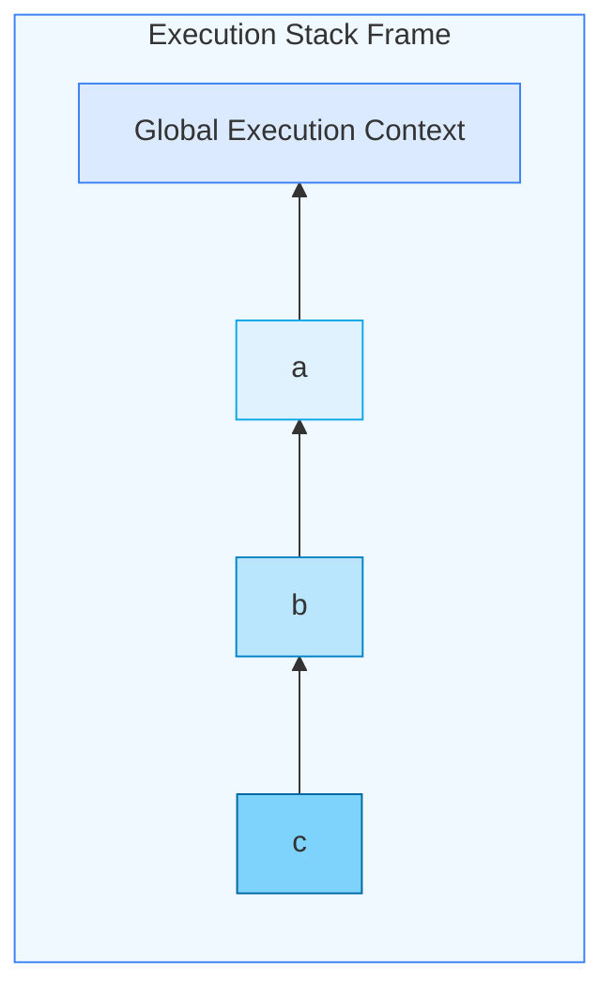
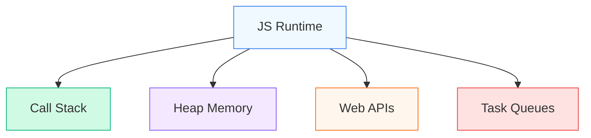
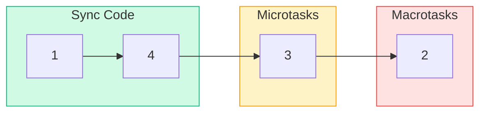
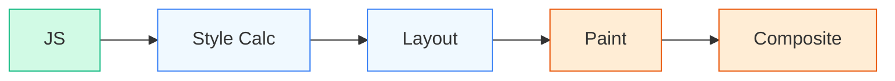
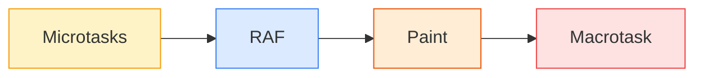
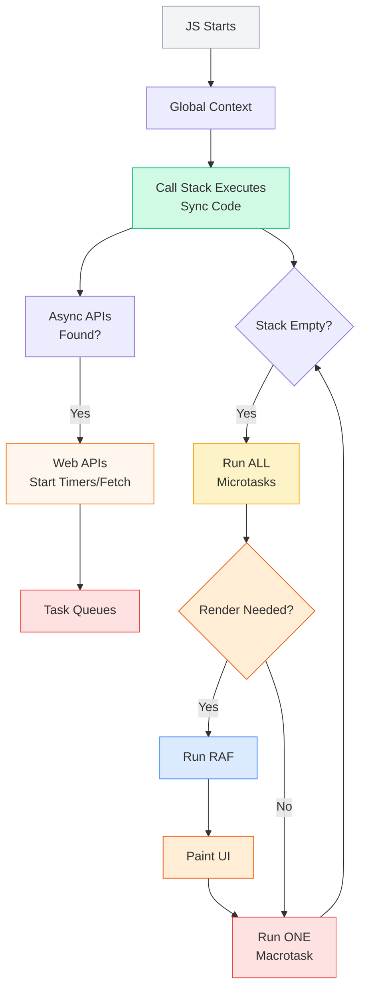

# 🔥 JavaScript RUNTIME ARCHITECTURE

## Call Stack · Heap · Event Loop · Tasks · Promises · Rendering

This chapter explains **how JavaScript actually runs over time**.

Everything async, performance, React rendering, hooks timing — **all depend on this**.

---

## 1️⃣ CALL STACK

### “Where JavaScript executes code”

The **Call Stack** is a **LIFO (Last In, First Out)** stack that stores **Execution Contexts**.

Every time:

* a function is called → pushed onto stack
* a function returns → popped off stack

---

### Example

```js
function a() {
  b();
}
function b() {
  c();
}
function c() {}

a();
```

### Call Stack Timeline



---

### 🔴 Important Rules

* **JS executes ONE stack frame at a time**
* Stack is **synchronous**
* If stack is busy → async callbacks must wait
* Infinite recursion → ❌ Stack Overflow

---

### Why JS is “single-threaded”

> Only **one call stack** exists
> Only **one execution context runs at a time**

But JS still handles async — because of the **Event Loop** (later).

---

## 2️⃣ HEAP MEMORY

### “Where objects and functions live”

The **Heap** is a large, unstructured memory area used for:

* Objects
* Arrays
* Functions
* Closures
* Fiber trees (React)
* DOM references

---

### Example

```js
let obj = { a: 10 };
```

### Memory Model

```mermaid
graph LR
    subgraph STACK[⚡ Stack Memory]
        REF[obj (Reference)]
    end
    
    subgraph HEAP[📦 Heap Memory]
        DATA[Object { a: 10 }]
    end
    
    REF -.->|Points to address| DATA
    
    style STACK fill:#f0f9ff,stroke:#3b82f6
    style HEAP fill:#f3e8ff,stroke:#8b5cf6
    style REF fill:#fff,stroke:#3b82f6
    style DATA fill:#fff,stroke:#8b5cf6
```

---

### Key Facts

* Stack → fast, limited, automatic cleanup
* Heap → large, slower, garbage collected
* Stack holds **references**, heap holds **data**

---

## 3️⃣ GARBAGE COLLECTION (High-level view)

JS engines (like V8) use **automatic GC**.

### Core idea:

> If an object is **not reachable from the root**, it can be deleted

### Roots:

* Global variables
* Current call stack
* Active closures

If nothing references an object → GC removes it.

---

## 4️⃣ THE EVENT LOOP (Heart of JS Runtime)

### “How async works in a single-threaded language”

JS runtime has:



---

### Why Event Loop exists

Because:

* JS stack cannot block
* I/O, timers, network take time
* Async work must run **after** stack is free

---

## 5️⃣ TASK TYPES (CRITICAL)

There are **TWO main queues**:

---

### 🟡 MACROTASK QUEUE

Examples:

* `setTimeout`
* `setInterval`
* DOM events
* I/O callbacks

---

### 🔵 MICROTASK QUEUE

Examples:

* `Promise.then`
* `catch`
* `finally`
* `queueMicrotask`
* MutationObserver

---

### ⚠️ RULE (EXTREMELY IMPORTANT)

> **Microtasks ALWAYS run before Macrotasks**

---

## 6️⃣ EVENT LOOP ALGORITHM (REAL)

The loop repeats forever.

```mermaid
graph TD
    START((Start)) --> CHECK{Stack Empty?}
    CHECK -- No --> EXEC[Execute Stack] --> CHECK
    CHECK -- Yes --> MICRO{Microtasks?}
    
    MICRO -- Yes --> RUNM[Run ALL Microtasks] --> MICRO
    MICRO -- No --> RENDER{Need Render?}
    
    RENDER -- Yes --> PAINT[🎨 Paint UI] --> MACRO
    RENDER -- No --> MACRO
    
    MACRO{Macrotask?} -- Yes --> RUNMACRO[Run ONE Macrotask] --> START
    MACRO -- No --> START
    
    style START fill:#f3f4f6,stroke:#94a3b8
    style EXEC fill:#d1fae5,stroke:#10b981
    style RUNM fill:#fef3c7,stroke:#f59e0b
    style PAINT fill:#ffedd5,stroke:#ea580c
    style RUNMACRO fill:#fee2e2,stroke:#ef4444
```



---

## 7️⃣ PROMISE SCHEDULING (INTERNAL)

Promises do **NOT** run immediately.

```js
Promise.resolve().then(cb);
```

Internally:

* `then(cb)` → pushed into **Microtask Queue**
* Executes **after stack clears**
* Executes **before any macrotask**

---

### Example (FULL TIMELINE)

```js
console.log(1);

setTimeout(() => console.log(2));

Promise.resolve().then(() => console.log(3));

console.log(4);
```

### Execution Order Timeline



---

## 8️⃣ MICROTASK STARVATION (IMPORTANT EDGE CASE)

```js
function loop() {
  Promise.resolve().then(loop);
}
loop();
```

What happens?

* Microtasks keep scheduling microtasks
* Macrotasks NEVER run
* UI freezes

This is called **Microtask Starvation**.

---

## 9️⃣ RENDER PIPELINE (Browser Side)

JS does NOT directly paint pixels.

Browser pipeline:



---

### What triggers render?

* DOM changes
* CSS changes
* Layout changes
* Animation frames

---

### When rendering happens

> Rendering happens **between event loop cycles**

Specifically:

* After microtasks
* Before next macrotask
* If rendering is needed

---

## 🔟 requestAnimationFrame (RAF)

```js
requestAnimationFrame(cb);
```

* Callback runs **before paint**
* Used for animations
* Runs once per frame (~16ms at 60Hz)

Order:



---

## 1️⃣1️⃣ setTimeout is NOT exact

```js
setTimeout(cb, 0);
```

Means:

> “Run **after minimum delay**, when stack + microtasks + render allow”

Not guaranteed timing.

---

## 1️⃣2️⃣ COMPLETE RUNTIME FLOW (MASTER DIAGRAM)



---

## 1️⃣3️⃣ WHY THIS MATTERS (ARCHITECTURE LEVEL)

| Concept | Used in |
|---------|---------|
| Call Stack | Function execution |
| Heap | Objects, closures, React fibers |
| Event Loop | Async behavior |
| Microtasks | Promises, hooks |
| Render pipeline | React DOM updates |
| RAF | Animations |
| Starvation | Performance bugs |

React:

* `useEffect` runs **after commit** → microtask/macrotask dependent
* Fiber scheduling cooperates with event loop
* Rendering must yield to browser

---

## 1️⃣4️⃣ FINAL LOCK-IN MENTAL MODEL

> JavaScript does **NOT** run async code in parallel
> It **schedules** work around a **single call stack**

Everything is:

* queued
* prioritized
* timed
* rendered between loops

---

### ✅ YOU NOW FULLY UNDERSTAND

* Why JS is single-threaded but async
* Why promises beat setTimeout
* Why UI freezes happen
* Why rendering timing matters
* Why React scheduling exists

This chapter is **complete** and **self-contained**.
