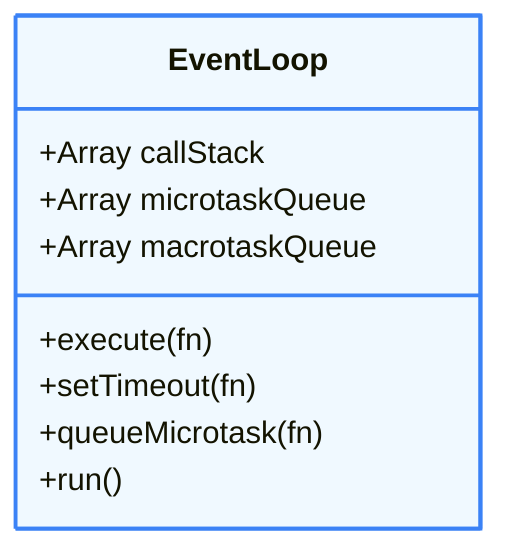

# 🛠 PROJECT — BUILD A MINI EVENT LOOP SIMULATOR (JS ARCHITECTURE LEVEL)

## 🎯 GOAL OF THIS PROJECT

You will **recreate how JavaScript actually schedules work**, including:

* Call Stack
* Macrotask Queue
* Microtask Queue
* Event Loop algorithm
* Execution order
* Starvation behavior

After this project, **the JS event loop will never be abstract again**.

---

# 🧠 WHAT WE ARE SIMULATING (REAL JS MODEL)

Real JS Runtime has:

```
Call Stack
Heap
Microtask Queue
Macrotask Queue
Event Loop
```

Our simulator will **mimic behavior**, not engine internals.

---

# 🧩 ARCHITECTURE DESIGN

We will build **5 core components**:

::: info 🏗️ Simulator Class Structure

:::

---

# 📁 PROJECT STRUCTURE (MENTAL)

```txt
event-loop-simulator.js
```

Single file is enough.

---

# 1️⃣ STEP 1 — CREATE BASIC DATA STRUCTURES

We simulate stacks and queues using arrays.

```js
class EventLoop {
  constructor() {
    this.callStack = [];
    this.microtaskQueue = [];
    this.macrotaskQueue = [];
  }
}
```

Explanation:

* `callStack` → LIFO
* `microtaskQueue` → FIFO
* `macrotaskQueue` → FIFO

---

# 2️⃣ STEP 2 — SIMULATE CALL STACK EXECUTION

### Call stack executes **synchronous code immediately**

```js
execute(fn) {
  this.callStack.push(fn);
  fn();
  this.callStack.pop();
}
```

This mimics:

* push execution context
* execute
* pop execution context

---

# 3️⃣ STEP 3 — SIMULATE TASK SCHEDULING

### Macrotask (setTimeout)

```js
setTimeout(fn) {
  this.macrotaskQueue.push(fn);
}
```

### Microtask (Promise.then)

```js
queueMicrotask(fn) {
  this.microtaskQueue.push(fn);
}
```

Important:

* These **DO NOT execute immediately**
* They wait for the event loop

---

# 4️⃣ STEP 4 — IMPLEMENT EVENT LOOP ALGORITHM

This is the **heart of the project**.

### REAL RULE:

```
1. Execute call stack
2. Execute ALL microtasks
3. Execute ONE macrotask
4. Repeat
```

---

### Implementation:

```js
run() {
  while (
    this.callStack.length ||
    this.microtaskQueue.length ||
    this.macrotaskQueue.length
  ) {
    // 1️⃣ Run all microtasks
    while (this.microtaskQueue.length) {
      const task = this.microtaskQueue.shift();
      this.execute(task);
    }

    // 2️⃣ Run one macrotask
    if (this.macrotaskQueue.length) {
      const task = this.macrotaskQueue.shift();
      this.execute(task);
    }
  }
}
```

Key insight:

* Microtasks drain completely
* Macrotasks run one per loop

---

# 5️⃣ STEP 5 — FULL SIMULATOR CODE (FINAL)

```js
class EventLoop {
  constructor() {
    this.callStack = [];
    this.microtaskQueue = [];
    this.macrotaskQueue = [];
  }

  execute(fn) {
    this.callStack.push(fn);
    fn();
    this.callStack.pop();
  }

  setTimeout(fn) {
    this.macrotaskQueue.push(fn);
  }

  queueMicrotask(fn) {
    this.microtaskQueue.push(fn);
  }

  run() {
    while (
      this.callStack.length ||
      this.microtaskQueue.length ||
      this.macrotaskQueue.length
    ) {
      while (this.microtaskQueue.length) {
        const microtask = this.microtaskQueue.shift();
        this.execute(microtask);
      }

      if (this.macrotaskQueue.length) {
        const macrotask = this.macrotaskQueue.shift();
        this.execute(macrotask);
      }
    }
  }
}
```

---

# 6️⃣ STEP 6 — TEST CASE (CRITICAL)

### Test program:

```js
const loop = new EventLoop();

loop.execute(() => {
  console.log("1");

  loop.setTimeout(() => console.log("2"));

  loop.queueMicrotask(() => console.log("3"));

  console.log("4");
});

loop.run();
```

### Expected Output:

```
1
4
3
2
```

✔ Exactly matches real JS behavior.

---

# 7️⃣ STEP 7 — STARVATION DEMO (IMPORTANT)

```js
const loop = new EventLoop();

loop.execute(() => {
  function infiniteMicrotask() {
    loop.queueMicrotask(infiniteMicrotask);
  }
  infiniteMicrotask();
});

loop.run();
```

What happens?

* Microtasks keep scheduling microtasks
* Macrotasks never execute
* Infinite loop

✔ You just simulated **microtask starvation**.

---

# 8️⃣ WHAT YOU HAVE ACTUALLY BUILT

You implemented:

| Feature             | Achieved |
| ------------------- | -------- |
| Call stack          | ✅        |
| Microtask queue     | ✅        |
| Macrotask queue     | ✅        |
| Event loop          | ✅        |
| Promise behavior    | ✅        |
| setTimeout behavior | ✅        |
| Starvation          | ✅        |

This is **exactly how JS scheduling works conceptually**.

---

# 9️⃣ ARCHITECTURE CONNECTION (IMPORTANT)

| Real JS    | Your Simulator   |
| ---------- | ---------------- |
| JS Engine  | execute()        |
| Call Stack | callStack[]      |
| Microtasks | microtaskQueue[] |
| Macrotasks | macrotaskQueue[] |
| Event Loop | run()            |

React Fiber **relies on this exact scheduling idea**, but adds priority lanes.

---

# 🧠 FINAL TAKEAWAY (LOCK THIS)

> JavaScript does not “run async code”
> It **schedules work around a single stack**

You now **understand the event loop at implementation level**, not theory.

---

If you want next **PROJECT** later (not now), it would naturally be:

* Closure memory visualizer
* Mini promise implementation
* Mini fiber scheduler

But this project **ends here**, fully complete.
