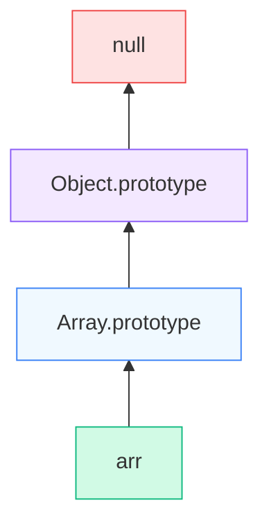
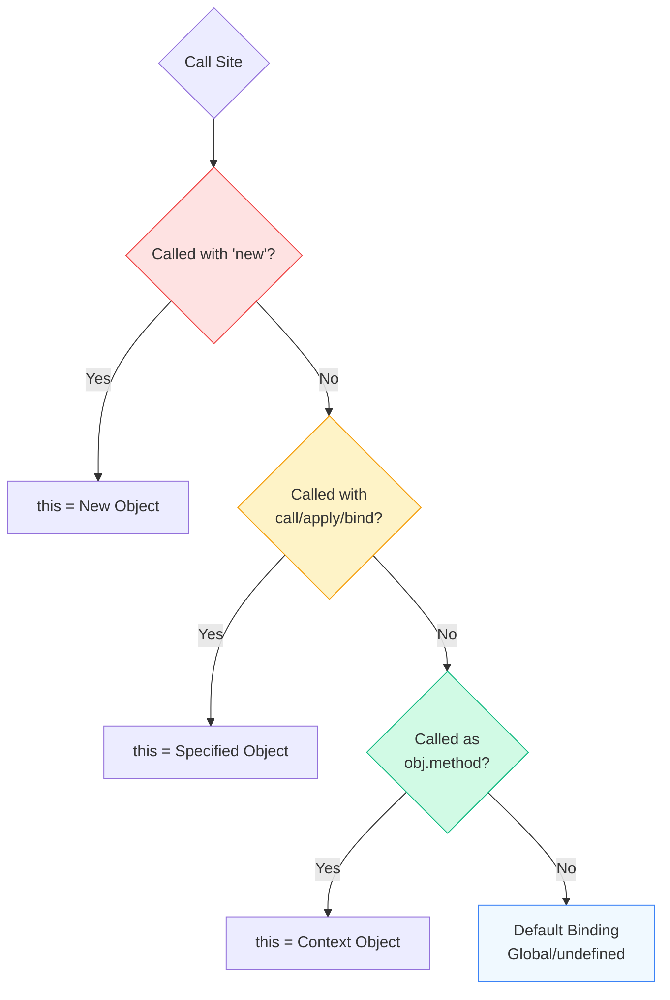

# 🔥 JavaScript OBJECT MODEL & OOP INTERNALS

## Prototype Chain · Object Creation · `this` Binding (ENGINE LEVEL)

JavaScript **does NOT have classical OOP** internally.
It has a **prototype-based object system**.

Understanding this correctly removes confusion around:

* `class`
* `extends`
* `this`
* inheritance bugs
* React class components
* method binding issues

---

## 1️⃣ THE REAL TRUTH ABOUT JAVASCRIPT OBJECTS

In JavaScript:

> **Everything is an object (or behaves like one)**
> Objects inherit from **other objects**, not classes.

There is **NO class blueprint at runtime**.

---

## 2️⃣ PROTOTYPE — THE CORE CONCEPT

Every JavaScript object has an **internal hidden property**:

```
[[Prototype]]
```

This is **NOT** `prototype`.

It is an **internal pointer** to another object.

---

### How to access it

```js
Object.getPrototypeOf(obj)
obj.__proto__   // legacy, but works
```

---

## 3️⃣ PROTOTYPE CHAIN (CRITICAL)

When you access a property:

```js
obj.someProp
```

JS engine searches:

```mermaid
graph TD
    SEARCH[🔎 Search for 'someProp'] --> OBJ[obj]
    OBJ -- Not Found --> P1{Has Prototype?}
    P1 -- Yes --> PROTO1[obj.[[Prototype]]]
    PROTO1 -- Not Found --> P2{Has Prototype?}
    P2 -- Yes --> PROTO2[Parent.[[Prototype]]]
    P2 -- No --> NULL[null]
    NULL --> UNDEF[Return undefined]
    
    style SEARCH fill:#fef3c7,stroke:#f59e0b
    style OBJ fill:#f0f9ff,stroke:#3b82f6
    style PROTO1 fill:#f3e8ff,stroke:#8b5cf6
    style PROTO2 fill:#d1fae5,stroke:#10b981
    style NULL fill:#fee2e2,stroke:#ef4444
    style UNDEF fill:#fee2e2,stroke:#ef4444
```

This is the **Prototype Chain**.

---

### Example

```js
const animal = {
  eats: true
};

const dog = {
  barks: true
};

Object.setPrototypeOf(dog, animal);
```

Lookup:

```
dog.barks → found on dog
dog.eats → found on animal
dog.fly → not found → undefined
```

---

## 4️⃣ FUNCTION PROTOTYPE vs OBJECT [[Prototype]]

### (MOST CONFUSING PART — READ CAREFULLY)

### 🔹 Every function has a `.prototype` property

```js
function Person() {}
Person.prototype.sayHi = function() {};
```

### 🔹 Every object has `[[Prototype]]`

```js
const p = new Person();
```

Internally:

```
p.[[Prototype]] === Person.prototype
```

---

### 🔑 RULE (MEMORIZE THIS)

```mermaid
graph TD
    FUNC[Function: Person] -->|has property| FPROTO[Person.prototype]
    INST[Instance: p] -.->|[[Prototype]] pointer| FPROTO
    
    style FUNC fill:#f3e8ff,stroke:#8b5cf6,stroke-width:2px
    style FPROTO fill:#f0f9ff,stroke:#3b82f6,stroke-width:2px
    style INST fill:#d1fae5,stroke:#10b981,stroke-width:2px
```

---

## 5️⃣ WHAT `new` ACTUALLY DOES (ENGINE STEPS)

```js
function Person(name) {
  this.name = name;
}
const p = new Person("A");
```

Internally:

```mermaid
graph TD
    START[new Person] --> CREATE[1. Create empty object {}]
    CREATE --> LINK[2. Link [[Prototype]] <br/>to Person.prototype]
    LINK --> BIND[3. Bind 'this' to new object]
    BIND --> EXEC[4. Execute Function Body]
    EXEC --> RETURN[5. Return Object]
    
    style START fill:#f3e8ff,stroke:#8b5cf6
    style CREATE fill:#f0f9ff,stroke:#3b82f6
    style LINK fill:#d1fae5,stroke:#10b981
    style BIND fill:#fef3c7,stroke:#f59e0b
    style EXEC fill:#fff7ed,stroke:#f97316
    style RETURN fill:#dcfce7,stroke:#22c55e
```

There is **NO magic**.

---

## 6️⃣ CLASS SYNTAX IS JUST SUGAR

```js
class Person {
  constructor(name) {
    this.name = name;
  }
  sayHi() {}
}
```

Internally becomes:

```js
function Person(name) {
  this.name = name;
}
Person.prototype.sayHi = function() {};
```

Classes:

* Do NOT change prototype behavior
* Do NOT introduce real classes
* Just safer syntax + TDZ

---

## 7️⃣ INHERITANCE INTERNALLY (`extends`)

```js
class Animal {
  eat() {}
}

class Dog extends Animal {
  bark() {}
}
```

Internally:

```
Dog.prototype.[[Prototype]] → Animal.prototype
Dog.[[Prototype]] → Animal
```

Two chains:

* instance chain
* constructor chain

---

## 8️⃣ FULL PROTOTYPE CHAIN (REAL)

```js
const arr = [];
```

Chain:



This is why:

```js
arr.toString()
```

works.

---

## 9️⃣ `this` — NOT LEXICAL, NOT STATIC

> `this` is determined **AT CALL TIME**, not where defined.

This is the #1 source of bugs.

---

## 🔟 `this` BINDING ALGORITHM (ENGINE RULES)

JavaScript follows **4 rules**, in order.



---

### RULE 1️⃣ — DEFAULT BINDING

```js
function foo() {
  console.log(this);
}
foo();
```

* Non-strict → `window`
* Strict → `undefined`

---

### RULE 2️⃣ — IMPLICIT BINDING

```js
const obj = {
  x: 10,
  foo() {
    console.log(this.x);
  }
};
obj.foo();
```

`this → obj`

---

### RULE 3️⃣ — EXPLICIT BINDING

```js
foo.call(obj);
foo.apply(obj);
```

`this → explicitly provided object`

---

### RULE 4️⃣ — `new` BINDING (HIGHEST PRIORITY)

```js
const a = new foo();
```

`this → newly created object`

---

### 🔑 PRIORITY ORDER (VERY IMPORTANT)

```
new
↓
explicit (call/apply/bind)
↓
implicit (obj.method())
↓
default
```

---

## 1️⃣1️⃣ ARROW FUNCTIONS (SPECIAL CASE)

Arrow functions **DO NOT have their own `this`**.

They **capture `this` lexically**.

```js
const obj = {
  x: 10,
  foo: () => {
    console.log(this.x);
  }
};
```

`this` → outer scope, NOT obj.

This is why arrows are used in callbacks.

---

## 1️⃣2️⃣ COMMON REAL-WORLD BUG (EXPLAINED)

```js
const obj = {
  value: 42,
  get() {
    return function () {
      console.log(this.value);
    };
  }
};

obj.get()();
```

Why `undefined`?

* inner function called standalone
* default binding applies
* `this !== obj`

---

## 1️⃣3️⃣ FIXES

```js
// Fix 1
return () => console.log(this.value);

// Fix 2
return function () {
  console.log(this.value);
}.bind(this);
```

---

## 1️⃣4️⃣ HOW REACT IS AFFECTED

| JS Concept      | React Impact     |
| --------------- | ---------------- |
| Prototype chain | Class components |
| `this` binding  | Event handlers   |
| Arrow functions | Safe callbacks   |
| Closure + this  | Hooks            |
| Object identity | Memoization      |

Hooks exist partly because:

> `this` is hard to reason about at scale

---

## 1️⃣5️⃣ FINAL MENTAL MODEL (LOCK THIS)

### Prototype

```
Objects delegate behavior
No classes at runtime
```

### OOP

```
JS = prototype delegation
Class = syntax sugar
```

### `this`

```
Decided at CALL TIME
NOT where written
```

---

## ✅ YOU NOW FULLY UNDERSTAND

* How inheritance really works
* Why prototype chain exists
* Why `class` is not real OOP
* Why `this` causes bugs
* How JS engine resolves methods

This chapter is **complete and closed**.
