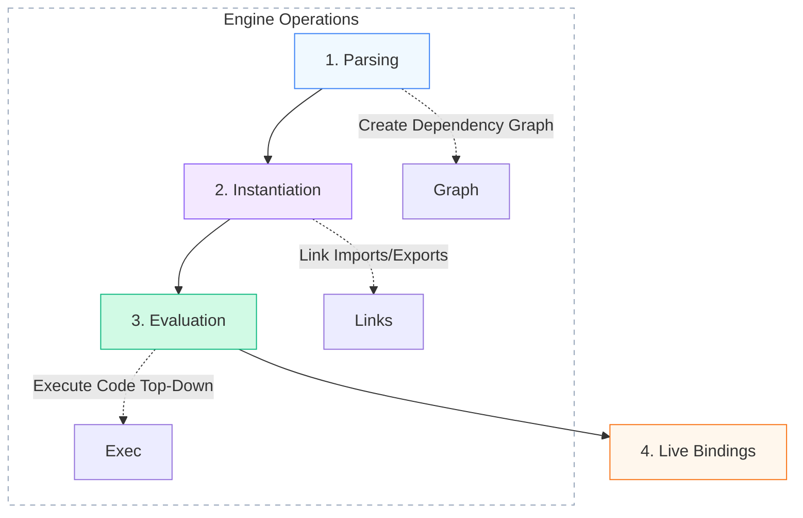

# 🔥 JavaScript MODULE SYSTEM (ARCHITECTURE LEVEL)

## ESM · CommonJS · Import Maps · Tree Shaking · Code Splitting

Modules are **not just syntax**.
They are a **loading, linking, execution, and optimization system** involving:

* JS engine
* Runtime (browser / Node)
* Bundler
* Dependency graph
* Static analysis

---

## 1️⃣ WHY MODULES EXIST (ARCHITECTURE VIEW)

Before modules:

* Global scope pollution
* Script order dependency
* No encapsulation
* No optimization possible

Modules solve:

* Isolation
* Dependency management
* Load ordering
* Static analysis
* Performance optimization

---

## 2️⃣ TWO MAJOR MODULE SYSTEMS

| System           | Designed for   | Nature                |
| ---------------- | -------------- | --------------------- |
| CommonJS (CJS)   | Node.js        | Runtime / Dynamic     |
| ES Modules (ESM) | Browser + Node | Static / Compile-time |

---

## 3️⃣ COMMONJS (CJS) — RUNTIME MODULE SYSTEM

### Syntax

```js
const fs = require("fs");

module.exports = {
  read
};
```

---

### How CJS works INTERNALLY

1. File is wrapped by Node:

```js
(function (exports, require, module, __filename, __dirname) {
  // your code
});
```

2. `require()` is a **function**
3. Module executes **immediately**
4. Result is cached
5. Exports are **mutable**

---

### Key Characteristics

| Feature      | Behavior     |
| ------------ | ------------ |
| Resolution   | Runtime      |
| Imports      | Dynamic      |
| Execution    | Immediate    |
| Caching      | Yes          |
| Tree shaking | ❌ Impossible |

---

### Why tree shaking is impossible in CJS

```js
if (condition) {
  require("./a");
}
```

Bundler **cannot know** this statically.

---

## 4️⃣ ES MODULES (ESM) — STATIC MODULE SYSTEM

### Syntax

```js
import { a } from "./a.js";
export const b = 2;
```

---

### ESM IS **NOT** JUST SYNTAX

It has a **4-phase lifecycle**.

---

## 5️⃣ ESM LIFECYCLE (ENGINE LEVEL)

### PHASE 1️⃣ — PARSING

* Imports detected
* Syntax validated
* Dependency graph created

### PHASE 2️⃣ — INSTANTIATION (LINKING)

* Module records created
* Imports linked to exports
* **No execution yet**

### PHASE 3️⃣ — EVALUATION

* Code executed in dependency order
* Topological sort
* One-time execution

### PHASE 4️⃣ — LIVE BINDINGS

* Imports are **references**, not copies

::: info 🔄 The 4 Phases of ESM

:::

---

## 6️⃣ LIVE BINDINGS (CRITICAL DIFFERENCE)

```js
// a.js
export let x = 1;
export function inc() {
  x++;
}

// b.js
import { x } from "./a.js";
console.log(x);
```

If `inc()` runs → `x` updates everywhere.

> ESM imports are **live views**, not snapshots.

---

## 7️⃣ WHY ESM ENABLES TREE SHAKING

ESM imports are:

* Static
* Top-level
* Known before execution

```js
import { a } from "./lib.js";
```

Bundler knows:

* Exactly what is imported
* Exactly what is unused

---

## 8️⃣ TREE SHAKING (BUNDLER LEVEL)

### Definition

> Removing unused exports from the final bundle

### Works ONLY because of:

* Static ESM syntax
* No runtime mutation
* No conditional imports

::: info ✂️ Tree Shaking Visualization

:::

---

### Example

```js
export function used() {}
export function unused() {}
```

```js
import { used } from "./lib.js";
```

Bundler removes `unused`.

---

### When tree shaking FAILS

```js
export default {
  a,
  b
};
```

Bundler cannot safely remove properties.

---

## 9️⃣ SIDE EFFECTS & TREE SHAKING

Bundlers assume:

```js
import "./polyfill.js";
```

This file **must run**, even if nothing is imported.

To help bundlers:

```json
{
  "sideEffects": false
}
```

This enables aggressive tree shaking.

---

## 🔟 IMPORT MAPS (BROWSER-LEVEL FEATURE)

Import maps allow **module resolution control** in browsers.

---

### Example

```html
<script type="importmap">
{
  "imports": {
    "react": "/cdn/react.js"
  }
}
</script>
```

```js
import React from "react";
```

---

### Why import maps exist

Browsers:

* Do NOT understand npm resolution
* Need absolute or relative URLs

Import maps bridge:

```
npm-style imports → browser URLs
```

---

### Import Map Characteristics

| Feature          | Behavior     |
| ---------------- | ------------ |
| Scope            | Browser      |
| Resolution       | Before fetch |
| Runtime          | Browser only |
| Bundler required | ❌ (optional) |

---

## 1️⃣1️⃣ MODULE LOADING IN BROWSER (REAL FLOW)

```mermaid
graph TD
    HTML[HTML Document] --> SCRIPT[Script type='module']
    SCRIPT --> FETCH[Fetch Module<br/>(Async)]
    FETCH --> PARSE[Parse & Dependencies]
    PARSE --> DEP{Has Imports?}
    DEP -- Yes --> FETCHDEP[Fetch Dependencies]
    FETCHDEP --> LINK[Link Modules]
    DEP -- No --> LINK
    LINK --> EXEC[Execute Code]
    
    style HTML fill:#f3f4f6,stroke:#94a3b8
    style SCRIPT fill:#f0f9ff,stroke:#3b82f6
    style FETCH fill:#fef3c7,stroke:#f59e0b
    style PARSE fill:#f3e8ff,stroke:#8b5cf6
    style LINK fill:#d1fae5,stroke:#10b981
    style EXEC fill:#dcfce7,stroke:#22c55e
```

* Modules load **async by default**
* `defer` is implicit

---

## 1️⃣2️⃣ CODE SPLITTING (RUNTIME + BUNDLER)

### Definition

> Splitting code into smaller chunks loaded on demand

---

### Static Import (NO split)

```js
import A from "./A.js";
```

---

### Dynamic Import (YES split)

```js
import("./A.js").then(A => {});
```

---

### What dynamic import does

1. Creates a **separate chunk**
2. Loaded only when needed
3. Returns a Promise
4. Scheduled as a microtask

---

## 1️⃣3️⃣ CODE SPLITTING USE CASES

* Route-based loading
* Feature-based loading
* Large libraries
* Performance optimization

---

## 1️⃣4️⃣ HOW BUNDLERS HANDLE SPLITTING

Bundlers:

* Build dependency graph
* Detect dynamic imports
* Create chunk boundaries
* Generate loader runtime

---

## 1️⃣5️⃣ ESM vs CJS (FINAL COMPARISON)

| Feature        | ESM           | CJS       |
| -------------- | ------------- | --------- |
| Resolution     | Static        | Runtime   |
| Tree shaking   | ✅             | ❌         |
| Imports        | Live bindings | Copies    |
| Execution      | Deferred      | Immediate |
| Browser native | ✅             | ❌         |

---

## 1️⃣6️⃣ HOW REACT & MODERN APPS USE THIS

* React uses **ESM**
* Bundlers rely on tree shaking
* `React.lazy` uses dynamic imports
* Vite leverages native ESM in dev
* Production bundles use splitting

---

## 1️⃣7️⃣ COMPLETE MENTAL MODEL (LOCK THIS)

```
ESM = static graph
CJS = runtime execution
Tree shaking = dead code removal
Code splitting = runtime chunk loading
Import maps = browser resolution control
```

---

## ✅ YOU NOW FULLY UNDERSTAND

* Why ESM replaced CJS
* Why tree shaking only works with ESM
* How bundlers analyze code
* How dynamic import really works
* Why module architecture matters for performance

This chapter is **complete and closed**.
