# 🔥 JavaScript ERROR HANDLING & FAILURE ARCHITECTURE

## Error Objects · Stack Unwinding · Async Errors · Microtask Starvation

This chapter explains **what really happens when JavaScript fails**.

If you understand this, you will:

* debug faster
* avoid silent async bugs
* understand React error boundaries
* understand why some crashes freeze the UI

---

## 1️⃣ WHAT AN ERROR REALLY IS (ENGINE LEVEL)

In JavaScript, an error is **NOT just a message**.

It is an **object created by the engine**.

```js
const err = new Error("Something went wrong");
```

Internally:

::: info 🧩 Error Object Internals

:::

---

### Error creation timing

The **stack trace is captured at the moment the error object is created**, not when thrown.

```js
const e = new Error();
throw e;
```

Stack is already frozen.

---

## 2️⃣ THROWING AN ERROR (WHAT REALLY HAPPENS)

```js
throw new Error("Fail");
```

Engine behavior:

1. Error object created (if not already)
2. Execution **stops immediately**
3. JS engine starts **stack unwinding**
4. Control moves to nearest matching `catch`
5. If none → program termination (or host handling)

---

## 3️⃣ STACK UNWINDING (CRITICAL CONCEPT)

### Definition

> Stack unwinding is the process of **popping execution contexts off the call stack** until a handler is found.

---

### Example

```js
function c() {
  throw new Error("boom");
}
function b() {
  c();
}
function a() {
  b();
}
a();
```

### Call Stack Unwinding

::: info 💥 The Unwinding Process

```mermaid
graph BT
    subgraph STACK[Stack Frame Actions]
        C[c: Throw 'boom'] --> B[b: Pop Frame ❌]
        B --> A[a: Pop Frame ❌]
        A --> G[Global: Crash / Terminate 💀]
    end
    
    style C fill:#fee2e2,stroke:#ef4444
    style B fill:#fff7ed,stroke:#f97316
    style A fill:#fff7ed,stroke:#f97316
    style G fill:#fef2f2,stroke:#b91c1c
```

:::

No remaining execution continues.

---

## 4️⃣ TRY / CATCH (RUNTIME MECHANISM)

```js
try {
  risky();
} catch (e) {
  console.log(e.message);
}
```

Internally:

* `try` registers a **catch boundary**
* Engine records a **handler address**
* On error → jumps to handler
* Stack is unwound **up to that boundary**

---

### Important rule

> `try/catch` only catches **synchronous errors** inside the same execution context.

---

## 5️⃣ WHY ASYNC ERRORS ESCAPE TRY/CATCH

```js
try {
  setTimeout(() => {
    throw new Error("oops");
  });
} catch (e) {
  console.log("caught?");
}
```

❌ NOT caught.

### Why?

::: info 🚫 Context Isolation

:::

* `setTimeout` callback runs in a **new execution context**
* Original `try` block has already exited
* No handler exists in that stack

---

## 6️⃣ PROMISE ERROR HANDLING (MICROTASK LEVEL)

Promises capture errors **inside their own chain**.

```js
Promise.resolve()
  .then(() => {
    throw new Error("fail");
  })
  .catch(err => console.log(err.message));
```

Internally:

* `.then()` callback runs as a **microtask**
* Throwing inside → converts to **rejected promise**
* `.catch()` handles it

---

### Async / Await (SUGAR)

```js
async function foo() {
  throw new Error("fail");
}
```

Internally:

```
return Promise.reject(Error)
```

---

### Proper async error handling

```js
try {
  await foo();
} catch (e) {
  console.log(e);
}
```

---

## 7️⃣ UNHANDLED REJECTIONS (HOST LEVEL)

```js
Promise.reject("boom");
```

If no `.catch()`:

* Browser → `unhandledrejection` event
* Node.js → process warning / crash (configurable)

Important:

> Unhandled rejections are **not synchronous crashes**
> They are detected **after microtask queue flush**

---

## 8️⃣ ERROR PROPAGATION MODEL (SYNC vs ASYNC)

| Context        | Propagation         |
| -------------- | ------------------- |
| Synchronous    | Stack unwinding     |
| Promise        | Microtask rejection |
| async/await    | Promise-based       |
| setTimeout     | Host-level error    |
| Event handlers | Host-level          |

---

## 9️⃣ MICROTASK STARVATION (DEEP RUNTIME ISSUE)

### Definition

> Microtask starvation occurs when microtasks continuously schedule new microtasks, preventing macrotasks and rendering.

### The Loop of Death

::: info ♾️ Infinite Microtask Loop

:::

---

### Example

```js
function loop() {
  Promise.resolve().then(loop);
}
loop();
```

---

### What happens internally

1. Microtask scheduled
2. Microtask runs
3. Schedules another microtask
4. Event loop **never reaches macrotasks**
5. Rendering never happens
6. UI freezes

---

### Event loop rule that causes this

```
Drain ALL microtasks
↓
Then render / macrotask
```

If microtasks never finish → starvation.

---

## 🔟 REAL-WORLD STARVATION CASES

### ❌ Bad

```js
async function poll() {
  await Promise.resolve();
  poll();
}
poll();
```

### ❌ Bad

```js
queueMicrotask(() => queueMicrotask(() => ...));
```

---

### ✅ Fix (yield to macrotask)

```js
setTimeout(poll, 0);
```

or

```js
await new Promise(r => setTimeout(r, 0));
```

---

## 1️⃣1️⃣ ERROR HANDLING & RENDERING (IMPORTANT)

Errors affect rendering because:

* JS must finish execution
* Microtasks must drain
* Rendering happens between loops

If errors:

* Abort execution
* Skip rendering
* Leave UI stale

---

## 1️⃣2️⃣ REACT CONNECTION (ARCHITECTURE IMPACT)

| JS Concept           | React Impact       |
| -------------------- | ------------------ |
| Stack unwinding      | Error boundaries   |
| Async errors         | useEffect failures |
| Unhandled rejections | Silent crashes     |
| Microtask starvation | UI freeze          |
| Throwing             | Suspense mechanism |

React Suspense uses:

```js
throw promise;
```

This relies on **controlled stack unwinding**.

---

## 1️⃣3️⃣ ERROR BOUNDARIES (WHY THEY EXIST)

React cannot catch:

* async errors
* promise rejections
* event handler errors

Because:

> They occur in **different execution contexts**

---

## 1️⃣4️⃣ FINAL MENTAL MODEL (LOCK THIS)

### Errors

```
Error = object + stack snapshot
```

### Stack unwinding

```
Pop frames until handler
```

### Async errors

```
Handled by promises, not try/catch
```

### Starvation

```
Infinite microtasks = frozen runtime
```

---

## ✅ YOU NOW FULLY UNDERSTAND

* How errors are created
* How stack unwinding works
* Why async errors escape try/catch
* Why unhandled rejections are dangerous
* Why microtask starvation freezes apps
* Why React error handling is limited

This chapter is **complete and closed**.
