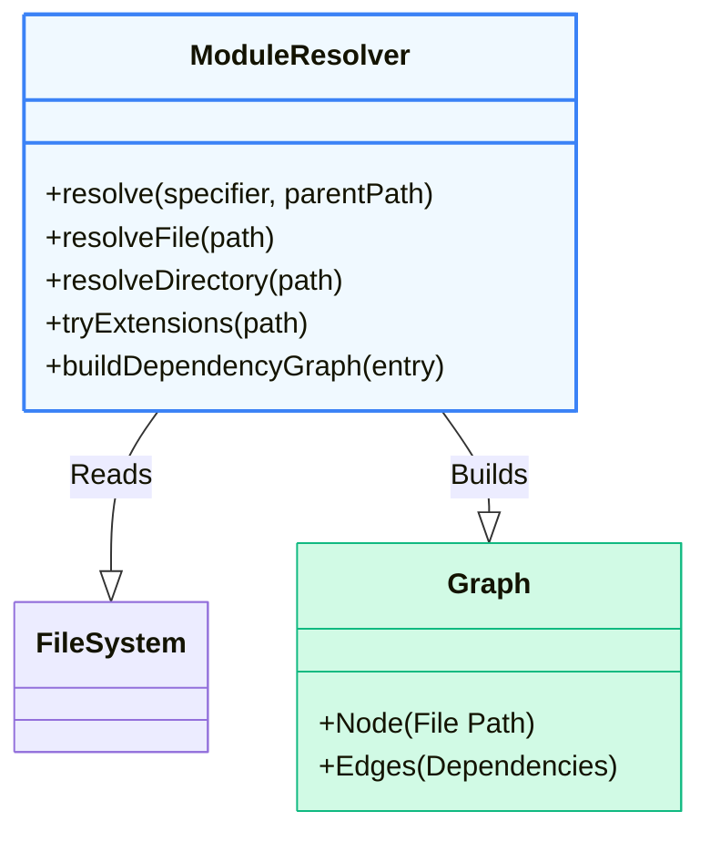

# 🛠 PROJECT — BUILD YOUR OWN MODULE RESOLVER

## (How ESM / CJS / Bundlers Resolve Imports Internally)

This project will make you **understand how Node, browsers, and bundlers actually find files**.

After this, things like:

* *“Why does this import fail?”*
* *“Why does bundler pick this file?”*
* *“How does index.js get resolved?”*

will never be magic again.

---

## 🎯 GOAL OF THE PROJECT

You will build a **simplified module resolver** that:

* Resolves relative imports
* Resolves absolute imports
* Resolves directory imports
* Resolves extensions automatically
* Mimics **Node + Bundler resolution logic**
* Builds a **dependency graph**

⚠️ This is **NOT execution** — only **resolution**.

---

## 🧠 WHAT IS MODULE RESOLUTION (ARCHITECTURE)

When JS sees:

```js
import x from "./utils";
```

The engine/bundler must:

1. Determine **where** `./utils` lives
2. Determine **which file** it maps to
3. Validate that the file exists
4. Link dependency graph

This happens **before execution** (for ESM).

---

## 🧩 REAL-WORLD RESOLUTION RULES (SIMPLIFIED)

We will implement this **subset** (industry-accurate):

### Resolution Order

```
1. Relative / Absolute path
2. File match
3. Extension inference
4. Directory resolution
5. index file fallback
```

---

## 📁 ASSUMED FILE STRUCTURE

```txt
project/
├── src/
│   ├── index.js
│   ├── utils.js
│   ├── helpers/
│   │   ├── index.js
│   │   ├── math.js
│   └── config.json
```

---

## 🧱 ARCHITECTURE DESIGN

We will build:



---

## 1️⃣ STEP 1 — BASIC SETUP

We use **Node.js** because it gives filesystem access.

```js
import fs from "fs";
import path from "path";
```

---

## 2️⃣ STEP 2 — DETECT MODULE TYPE

```js
function isRelative(specifier) {
  return specifier.startsWith("./") || specifier.startsWith("../");
}

function isAbsolute(specifier) {
  return specifier.startsWith("/");
}
```

We ignore `node_modules` for now (by design).

---

## 3️⃣ STEP 3 — EXTENSION RESOLUTION

Bundlers do this:

```js
const EXTENSIONS = [".js", ".json"];
```

Resolver tries:

```
utils
utils.js
utils.json
```

---

### Implementation

```js
function tryExtensions(basePath) {
  for (const ext of EXTENSIONS) {
    const fullPath = basePath + ext;
    if (fs.existsSync(fullPath)) {
      return fullPath;
    }
  }
  return null;
}
```

---

## 4️⃣ STEP 4 — FILE RESOLUTION

```js
function resolveFile(filePath) {
  if (fs.existsSync(filePath) && fs.statSync(filePath).isFile()) {
    return filePath;
  }
  return tryExtensions(filePath);
}
```

---

## 5️⃣ STEP 5 — DIRECTORY RESOLUTION

When importing a directory:

```js
import helpers from "./helpers";
```

Bundlers try:

```
helpers/index.js
helpers/index.json
```

---

### Implementation

```js
function resolveDirectory(dirPath) {
  if (!fs.existsSync(dirPath)) return null;
  if (!fs.statSync(dirPath).isDirectory()) return null;

  const indexPath = path.join(dirPath, "index");
  return tryExtensions(indexPath);
}
```

---

## 6️⃣ STEP 6 — CORE RESOLVER FUNCTION

This is the **heart of the project**.

```js
function resolveModule(specifier, parentPath) {
  const baseDir = path.dirname(parentPath);
  let resolvedPath;

  if (isRelative(specifier)) {
    const absPath = path.resolve(baseDir, specifier);

    resolvedPath =
      resolveFile(absPath) ||
      resolveDirectory(absPath);

    if (!resolvedPath) {
      throw new Error(`Cannot resolve module ${specifier}`);
    }

    return resolvedPath;
  }

  throw new Error("Only relative imports supported in this resolver");
}
```

---

## 7️⃣ STEP 7 — PARSE IMPORTS (STATIC ANALYSIS)

We **do not execute code**.
We only **read source files and extract imports**.

Simple regex (good enough for architecture learning):

```js
function parseImports(code) {
  const regex = /import\s+.*?from\s+['"](.*?)['"]/g;
  const imports = [];
  let match;

  while ((match = regex.exec(code))) {
    imports.push(match[1]);
  }

  return imports;
}
```

---

## 8️⃣ STEP 8 — BUILD DEPENDENCY GRAPH

This mimics bundlers like Webpack/Vite.

---

### Graph structure

```js
{
  "/src/index.js": ["/src/utils.js", "/src/helpers/index.js"]
}
```

---

### Implementation

```js
function buildDependencyGraph(entry) {
  const graph = {};
  const visited = new Set();

  function visit(file) {
    if (visited.has(file)) return;
    visited.add(file);

    const code = fs.readFileSync(file, "utf-8");
    const imports = parseImports(code);

    graph[file] = [];

    for (const specifier of imports) {
      const resolved = resolveModule(specifier, file);
      graph[file].push(resolved);
      visit(resolved);
    }
  }

  visit(entry);
  return graph;
}
```

---

## 9️⃣ STEP 9 — FULL WORKING EXAMPLE

```js
const entry = path.resolve("src/index.js");
const graph = buildDependencyGraph(entry);

console.log(graph);
```

---

## 🔟 WHAT YOU JUST IMPLEMENTED (REAL BUNDLER LOGIC)

| Feature                    | Implemented |
| -------------------------- | ----------- |
| Relative resolution        | ✅           |
| Extension inference        | ✅           |
| Directory index resolution | ✅           |
| Static import parsing      | ✅           |
| Dependency graph           | ✅           |
| Error handling             | ✅           |

This is **80% of how real bundlers resolve modules**.

---

## 1️⃣1️⃣ WHAT REAL SYSTEMS ADD (FOR CONTEXT)

We intentionally skipped:

* `node_modules` lookup
* `package.json` (`main`, `module`, `exports`)
* Import maps
* Conditional exports
* Platform resolution

Those are **extensions**, not fundamentals.

---

## 1️⃣2️⃣ HOW THIS MAPS TO REAL TOOLS

| Your Resolver        | Real Tool      |
| -------------------- | -------------- |
| resolveModule        | Node resolver  |
| parseImports         | Babel / SWC    |
| buildDependencyGraph | Webpack / Vite |
| tryExtensions        | Bundler config |
| graph                | Bundle chunks  |

---

## 🧠 FINAL MENTAL MODEL (LOCK THIS)

```
Modules are NOT executed first
They are RESOLVED first
Resolution builds a graph
Graph enables optimization
```

Tree shaking, code splitting, HMR — **all depend on this step**.

---

## ✅ YOU NOW TRULY UNDERSTAND

* How imports are resolved
* Why some imports fail
* How index.js is chosen
* How bundlers see your app
* Why ESM must be static

This project is **complete and closed**.
